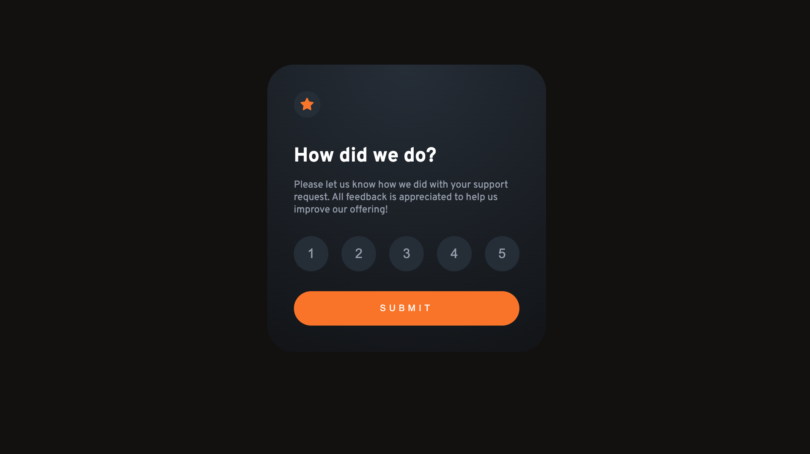
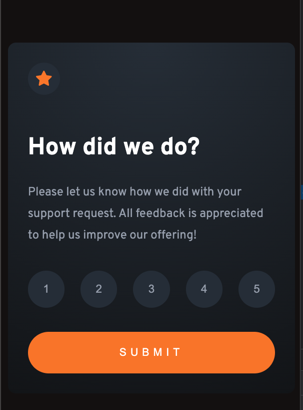

# Frontend Mentor - Interactive rating component solution

This is a solution to the [Interactive rating component challenge on Frontend Mentor](https://www.frontendmentor.io/challenges/interactive-rating-component-koxpeBUmI). Frontend Mentor challenges help you improve your coding skills by building realistic projects. 

## Table of contents

- [Overview](#overview)
  - [The challenge](#the-challenge)
  - [Screenshot](#screenshot)
  - [Links](#links)
- [My process](#my-process)
  - [Built with](#built-with)
  - [What I learned](#what-i-learned)
  - [Continued development](#continued-development)
  - [Useful resources](#useful-resources)
- [Author](#author)
- [Acknowledgments](#acknowledgments)

**Note: Delete this note and update the table of contents based on what sections you keep.**

## Overview

### The challenge

Users should be able to:

- View the optimal layout for the app depending on their device's screen size
- See hover states for all interactive elements on the page
- Select and submit a number rating
- See the "Thank you" card state after submitting a rating

### Screenshot

### Links

- Solution URL: [GitHub](https://github.com/spencer-rafada/frontendmentor-challenges/tree/master/interactive-rating-component-main)
- Live Site URL: [Live Site](https://spencer-rafada.github.io/interactive-rating-component-main/)

## My process

### Built with

- [React](https://reactjs.org/) - JS library
- BEM Notation
- SCSS

### What I learned

I learned how to map the ratings array and customize it in the CSS. Also, I was able to style the project with relative ease due to the help of BEM notation. 

### Continued development

In the future, I will start perojects with Mobile-First Workflow. I will also try to develop this project by adding the orange active states on the buttons.

### Useful resources

- [CSS Gradient](https://cssgradient.io/)

## Author

- Website - [Spencer Rafada](https://github.com/spencer-rafada)
- Frontend Mentor - [@spencer-rafada](https://www.frontendmentor.io/profile/spencer-rafada)
- LinkedIn - [N. Spencer Rafada](https://www.linkedin.com/in/spencer-rafada/)

## Acknowledgments

I acknowledge the people that I am surrounded with for continuing to give me feedback on the passion projects that I work on. Salute!
